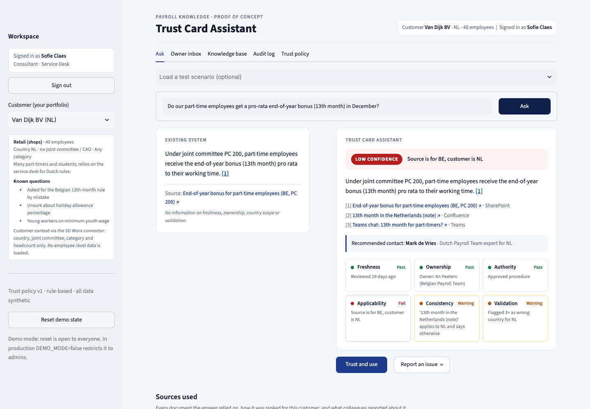
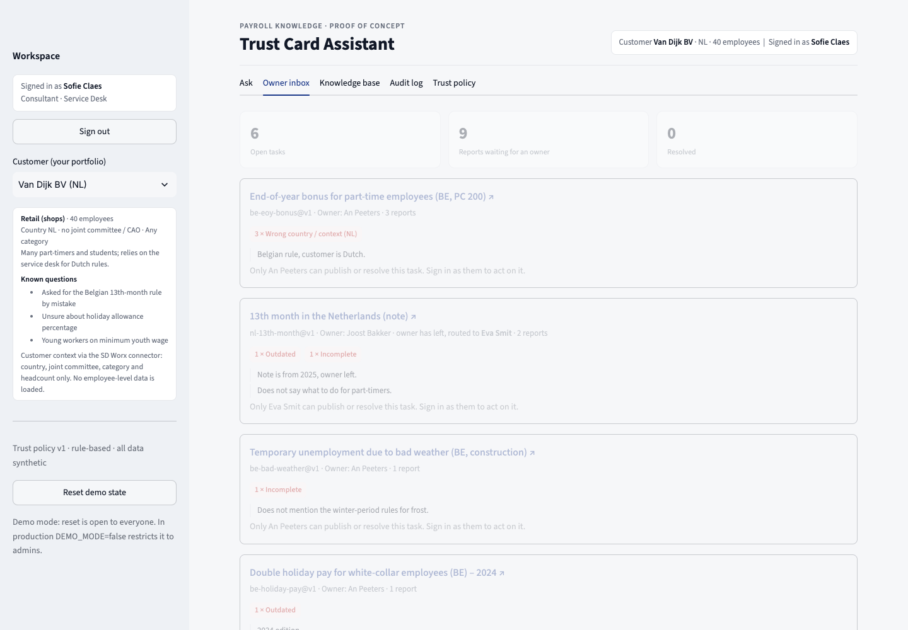
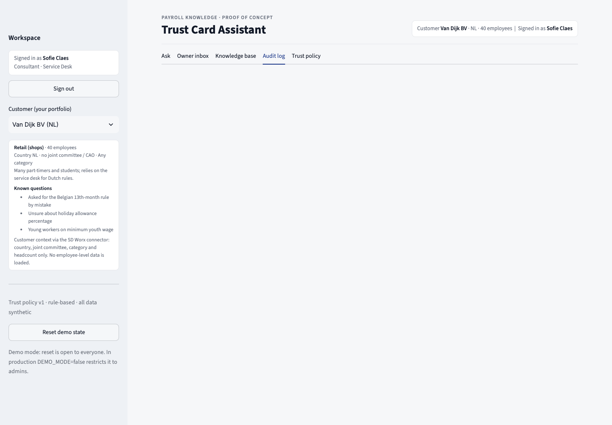

# Trust Card Assistant

**Payroll answers you can verify before you send them.** A proof of concept built for the TecTonic Hackathon.

Consultants at a payroll provider can find answers, but they cannot tell whether a source is current, owned, official,
or even valid for their customer's country. The Trust Card Assistant answers the question **and** shows why the answer
can or cannot be relied on. When someone doubts an answer, one click records why, and that doubt changes ranking,
reputation and the document owner's to-do list in seconds. The system never retrains a model; it fixes the source.

> *Feedback may create doubt automatically, but only people can create certainty.*



## Quick start

Requires Docker Desktop.

```bash
git clone git@github.com:Empel06/TectonicHackathon.git
cd TectonicHackathon
docker compose up --build
```

Open **http://localhost:8501** and sign in. Every demo account uses the password `demo2026`:

| Username | Role | Use it for |
|---|---|---|
| `sofie` | Consultant | Asking questions and reporting doubt |
| `eva-smit` | Owner, Netherlands | Publishing the corrected Dutch document |
| `an-peeters` | Owner, Belgium | Belgian procedures |
| `lotte-wouters` | Owner, Belgian social law | Hospitality and student work |
| `bram-janssen` | Owner, Dutch healthcare | CAO VVT and Zorggroep Oost |
| `mark-de-vries` | Expert, Netherlands | Confirming answers |
| `sarah-dubois` | Expert, Belgium | Confirming answers |
| `admin` | Admin | Reset, audit, quarantined sources |
| `joost-bakker` | Left the company | Shows that the login is refused |

The demo state lives on a Docker volume. Click **Reset demo state** in the sidebar before a demo, or after pulling new data.

**No API key is needed.** Retrieval, trust scoring, feedback and the owner inbox all run locally. Answers are the cited
source's own summary, so nothing is invented.

## Demo in five steps (about 3.5 minutes)

1. **The problem.** Sign in as `sofie`, keep customer *Van Dijk BV (NL)* and click **Ask**. The existing system
   confidently answers with the Belgian PC 200 rule.
2. **The Trust Card.** The same question and documents give **LOW: "Source is for BE, customer is NL"**, a recommended
   Dutch expert, and six signals. Click `[1]` to open the source and check it yourself.
3. **Doubt becomes data.** Click **Report an issue → Wrong country / context**. This is the 4th report, and the Belgian
   document drops for Dutch questions only.
4. **Fix the source.** Sign out, sign in as `eva-smit`, and open **Owner inbox → Write and publish a corrected
   version**. Ask again: **MEDIUM**, new version, not yet validated.
5. **Certainty from people.** Sign in as `mark-de-vries`, ask, and click **Confirm as expert**: **HIGH**.

The **Scenario** dropdown holds 27 prepared cases across six demo companies: expired rules, contradicting
procedures, popular-but-wrong chats, broken metadata, confidential customer files and more. See
[docs/scenarios.md](docs/scenarios.md).

## Features

| | |
|---|---|
| **Trust Card** | Confidence (HIGH, MEDIUM, LOW, UNKNOWN) from six rule-based signals: freshness, ownership, authority, applicability (country, joint committee, employee category, validity dates), consistency and validation |
| **Side-by-side comparison** | The existing system's answer next to the Trust Card, for the same question |
| **Verifiable sources** | Clickable citations open the exact version used: its location (SharePoint, Confluence, Teams, customer file), its content (Teams chats as the full thread), trust details, feedback history and a download |
| **Structured feedback** | One-click reasons (outdated, wrong country, contradicts, incorrect, incomplete, unclear) update reputation and per-country ranking immediately |
| **Owner inbox** | Reports are routed to the document owner, or to a colleague if the owner has left. Owners write and publish a corrected version; the old one stays as *Superseded* |
| **Knowledge base** | 30 synthetic sources with status, classification, data-quality issues and version history |
| **Free questions, no language model** | Any question in English, Dutch or French: payroll synonyms ("vakantiegeld", "eindejaarspremie", "salaire garanti"), light stemming ("paid" finds "payment") and a noise guard, so an unrelated question gives UNKNOWN instead of a guess |
| **Audit log and trust policy** | Hash-chained, tamper-evident event log; every threshold in a versioned `config/policy.yaml` |



## Security

Security is built in, not added afterwards. Every rule below is enforced in the service layer and covered by tests.

- **Authentication:** salted PBKDF2 password hashes, constant-time checks, lockout after 5 failures; people who left are refused.
- **Authorisation:** only the routed owner publishes, only experts give expert verdicts, and consultants only see customers in their portfolio.
- **Customer data separation:** confidential customer files are used only for that customer and only by its team, enforced before retrieval. Direct links are checked too, and refusals are logged.
- **Personal data:** sources containing national numbers, IBANs, BSNs, email addresses or phone numbers are quarantined, and feedback comments are redacted before storage.
- **Integrity:** a hash-chained audit log detects tampering (try **Audit log → Simulate tampering**).
- **Supply chain:** `requirements.lock` pins all 41 dependencies with SHA-256 hashes, and the image installs with `--require-hashes`.
- **Container:** non-root user, read-only filesystem, all capabilities dropped, `no-new-privileges`, port bound to localhost.

The threat model, what SD Worx handles as a payroll processor, and the production access design are in
[SECURITY.md](SECURITY.md).



## How it works

```
ui/app.py          Streamlit UI: ask, owner inbox, knowledge base, audit log, trust policy, source pages
   │  plain function calls
app/service.py     Service layer: the contract the UI uses; enforces permissions and access
   ├── core/       Pure trust logic: retrieval, reputation, six signals, confidence policy, data quality
   ├── app/access.py, auth.py, privacy.py   Access control, login, personal-data redaction
   └── app/store.py   Documents on disk plus an append-only, hash-chained event log
```

1. The question is normalised (Dutch and French terms) and matched against the live document versions the user may use.
2. Ranking combines keyword relevance, per-country feedback penalties and metadata fit.
3. Six signals are computed on the top source, and the confidence policy applies a ceiling rule: any failing signal
   means LOW, whatever the votes.
4. Feedback, publications and answers are appended to the event log, and reputation is recomputed from it on every question.

The full design rationale, including why feedback does not mean fine-tuning, is in
[docs/solution-design.md](docs/solution-design.md).

## Project structure

```
app/            Service layer, access control, authentication, privacy, event store, answer composer
core/           Trust logic (pure functions) and policy loader
ui/             Streamlit application
config/         Versioned trust policy (policy.yaml)
data/           Synthetic documents, people, customers, hashed demo accounts, seeded feedback
tests/          63 tests: trust core, demo flow, edge cases, security, data access
docs/           Solution design, scenarios, screenshots
```

## Development

```bash
python3.12 -m venv .venv && source .venv/bin/activate   # the lockfile targets Python 3.12
pip install --require-hashes -r requirements.lock
streamlit run ui/app.py        # the app, with reload on save
pytest -q                      # 63 tests; test_demo_flow.py replays the demo
```

Tests also run in the container (`docker run --rm trust-card python -m pytest -q`) and on every push through GitHub Actions.

## Limitations

- **Keyword retrieval.** It is deterministic on purpose; production would use hybrid search with the same trust layer on top.
- **Template answers.** Answers are the source's summary; a company-provided language model could phrase them, but never decide confidence.
- **Simulated sources and identities.** Source locations, the customer connector and logins are simulated; production uses SSO and real connectors acting with the user's own permissions.
- **Synthetic data only.**

## Team

Built by a team of three at the TecTonic Hackathon, 30 September 2026.
