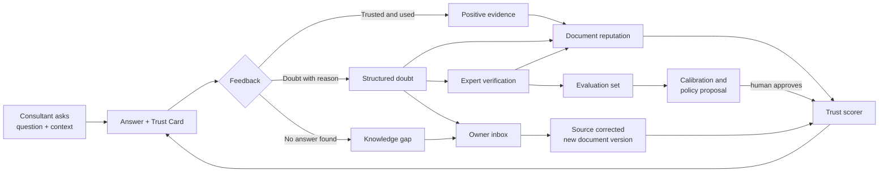
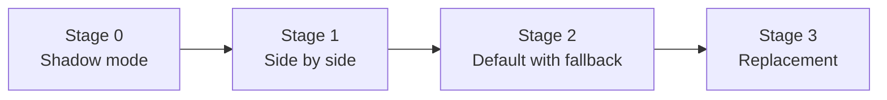
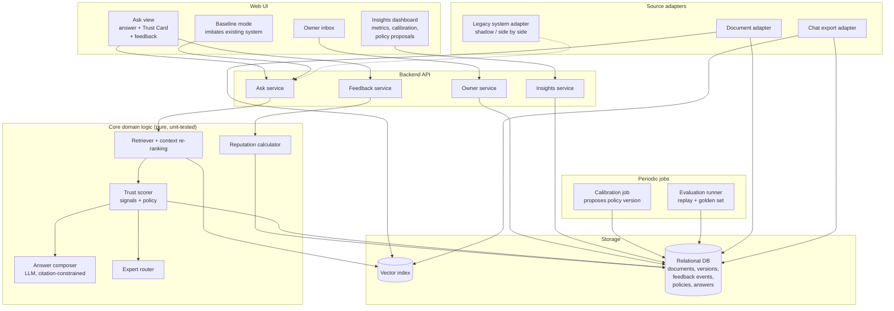
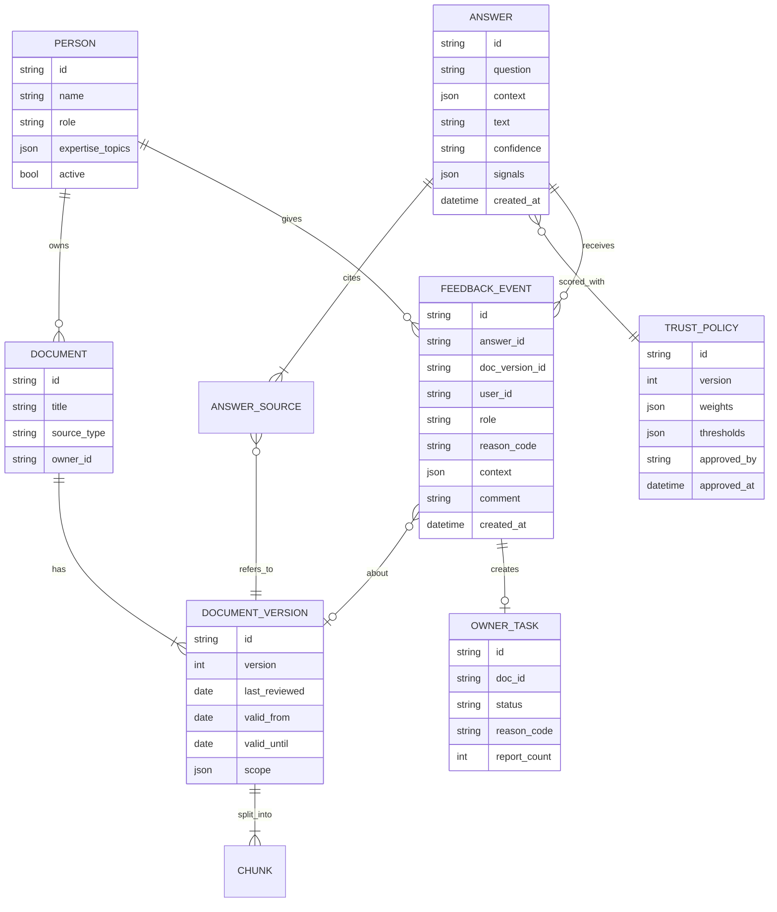

# Solution Design — Trust Card Assistant with Feedback Loop (Idea 1 + Idea 7)

> **Status:** Original solution design written before the hackathon. The proof of concept in this repository implements a scoped-down version; see the [README](../README.md) for what is built.
> Items marked `[ ]` are decision points.

---

## Table of Contents

1. [Summary (TL;DR)](#1-summary-tldr)
2. [What We Are Building](#2-what-we-are-building)
3. [What "Training with Feedback" Should and Should Not Mean](#3-what-training-with-feedback-should-and-should-not-mean)
4. [The Trust Loop](#4-the-trust-loop)
5. [Feedback Design (Idea 7 in Detail)](#5-feedback-design-idea-7-in-detail)
6. [How Feedback Changes the System](#6-how-feedback-changes-the-system)
7. [Guardrails: Why Feedback Cannot Corrupt Trust](#7-guardrails-why-feedback-cannot-corrupt-trust)
8. [Taking Over the Existing System](#8-taking-over-the-existing-system)
9. [Architecture](#9-architecture)
10. [Data Model](#10-data-model)
11. [API Design](#11-api-design)
12. [Proof of Concept Scope](#12-proof-of-concept-scope)
13. [Demonstrating Learning in a Hackathon](#13-demonstrating-learning-in-a-hackathon)
14. [Test Strategy (TDD)](#14-test-strategy-tdd)
15. [Proposed Project Structure](#15-proposed-project-structure)
16. [Implementation Plan and Milestones](#16-implementation-plan-and-milestones)
17. [Security and Privacy](#17-security-and-privacy)
18. [Open Decisions](#18-open-decisions)

---

## 1. Summary (TL;DR)

- **Idea 1** answers questions and wraps every answer in a **Trust Card**: freshness, ownership, authority, applicability and consistency.
- **Idea 7** collects **structured doubt**: when a user does not trust or cannot use an answer, they say *why* (outdated, wrong country, contradicts another source, incomplete, and so on).
- **The combination is a closed loop.** Each feedback reason maps to a specific trust signal. Feedback therefore adjusts the system in an explainable way ("this document was flagged as outdated by 4 consultants and 1 expert") instead of silently retraining a black box.
- **"Training" should not mean fine-tuning the language model.** Feedback should update document reputation, retrieval ranking, calibrated signal weights, an evaluation test set and, most importantly, route problems to the people who own the documents so that the *source* is fixed.
- **Taking over the existing system** happens in measurable stages: shadow mode → side by side → default with fallback → replacement. Each stage has a gate based on data the feedback loop produces. The core metric is **calibration**: when the system says HIGH confidence, is the answer actually right?
- **The PoC demonstrates all of this** by comparing a plain "existing system" baseline with our assistant, running a live feedback round that visibly changes a Trust Card, and showing a dashboard built from simulated feedback history.

---

## 2. What We Are Building

### 2.1 One sentence

> An assistant that tells employees not only *what* the answer is, but *why* they can rely on it, and that becomes more reliable every time someone expresses doubt.

### 2.2 Users and their jobs

| User | Job | What they see |
|---|---|---|
| **Consultant** (primary) | Answer a customer question quickly and defensibly | Answer, Trust Card, sources, feedback buttons, "who to ask" |
| **Domain expert** | Confirm or correct answers in their area | Verification requests; their feedback carries more weight |
| **Knowledge owner** | Keep their documents correct | Inbox of flagged documents with reasons and example questions |
| **Knowledge team / product owner** | Decide when the new system can replace the old one | Metrics dashboard, trust policy versions, rollout stage |

### 2.3 Key assumption

We assume "the existing system" is SD Worx's current way of finding knowledge: an enterprise search or an AI assistant that returns answers or documents **without** trust information. We cannot connect to it during the hackathon, so the PoC includes a **baseline mode** that imitates it: the same question, the same documents, answered without a Trust Card or feedback loop.

- [ ] Confirm this assumption, or describe the existing system if the team knows more about it.

---

## 3. What "Training with Feedback" Should and Should Not Mean

"Training the system with feedback" can mean very different things. They differ strongly in cost, risk and explainability.

| Option | What changes | Explainable? | Data needed | Risk | Recommendation |
|---|---|:-:|---|---|---|
| **A. Fix the source** | Feedback is routed to the document owner, who corrects or retires the document | Yes | 1 flag | Low | **Core** |
| **B. Document reputation** | Each document version gets a feedback-based score that becomes a sixth trust signal ("Validation") | Yes | A few events per document | Low | **Core** |
| **C. Retrieval re-ranking** | Documents often flagged as wrong for a given context are ranked lower for that context | Yes | Tens of events | Medium | **Core (simple version)** |
| **D. Signal weight calibration** | Feedback history is used to fit how much each signal should count, producing a *calibrated* confidence | Yes, weights are visible | Hundreds of events | Medium | **PoC with simulated data** |
| **E. Evaluation set** | Verified question–answer pairs become regression tests for every change | Yes | Grows over time | Low | **Core** |
| **F. Fine-tuning the LLM** | Model weights change | No | Thousands of examples | High | **Not recommended** |

### Why not fine-tuning (option F)?

1. **It fixes the wrong thing.** If a document is outdated, the correct fix is to update the document. Teaching the model to "know better" hides the problem and makes the model disagree with its own sources.
2. **It is a black box.** The brief explicitly asks us not to hide complexity behind a black box.
3. **It cannot be undone precisely.** A wrong document can be retired in seconds; a wrong lesson learned by a model cannot.
4. **Payroll rules change every year.** Knowledge stored in model weights goes stale silently; knowledge stored in documents has dates and owners.
5. **Cost and privacy.** Fine-tuning on internal chats and payroll questions puts sensitive data into model weights.

**Analogy.** Our system is like a newsroom with a fact-check desk. When readers report a mistake, you do not retrain the journalists' brains. You correct the article, note who corrected it and when, trust that source a little less until it is fixed, and add the case to the fact-checkers' checklist.

---

## 4. The Trust Loop



Three speeds of learning:

| Speed | Mechanism | Example |
|---|---|---|
| **Immediate** (seconds) | Reputation update and re-ranking | Three flags "wrong country" → the document is marked with a warning for that country |
| **Human** (hours to days) | Owner fixes the source; expert verifies an answer | Owner publishes version 2; old feedback no longer applies to it |
| **Periodic** (weekly) | Weight calibration and a proposed new trust policy, tested against the evaluation set and approved by a person | "Freshness should count more for tax questions" |

---

## 5. Feedback Design (Idea 7 in Detail)

### 5.1 Principles

1. **Ask for the reason, not only thumbs up or down.** A thumbs down without a reason cannot be acted on. A reason can be mapped to a trust signal.
2. **One click for the common case.** Feedback that takes effort is not given. Reasons are buttons, and a comment is optional.
3. **Capture doubt before action, not only afterwards.** The most valuable moment is "I do not trust this enough to send it to the customer."
4. **Close the loop visibly.** Users who flag something see what happened to it ("The owner updated this document on 3 October"). This is how feedback remains worth giving.

### 5.2 Feedback types and reason codes

| Feedback | Reason code | Maps to trust signal | Default action |
|---|---|---|---|
| 👍 **I trust this and will use it** | `trusted_used` | Validation (+) | Increase reputation |
| 👎 **I don't trust this** | `outdated` | Freshness | Reputation −; notify owner |
| | `wrong_context` (country, entity, collective agreement) | Applicability | Demote for that context; notify owner |
| | `contradicts_other_source` | Consistency | Create conflict item; request expert verification |
| | `incorrect` | Validation (−) | Request expert verification; notify owner |
| | `incomplete` | Gap | Add to gap list |
| | `unclear` | None (answer quality) | Log for prompt and UX improvement |
| 🔍 **Nothing useful found** | `no_answer` | Gap | Add to gap list; suggest expert |
| 🧑‍🏫 **Expert verdict** | `expert_confirmed` / `expert_rejected` | Validation (strong) | Strong reputation change; add to evaluation set |

### 5.3 Implicit signals (optional, later)

| Signal | Interpretation | Reliability |
|---|---|---|
| Copies the answer or opens the source | Weak positive | Low |
| Rephrases the same question within 2 minutes | Weak negative | Medium |
| Clicks "ask an expert" | Documents were not enough | High |

For the PoC we use **explicit feedback and expert escalation only**. Implicit signals are noisy and raise privacy questions (see [Section 17](#17-security-and-privacy)).

### 5.4 What a feedback event must record

Feedback is only useful later if we know exactly **what the user saw**. Each event therefore stores a snapshot: the question, the context, the answer, the document *versions* used, the signals shown and the trust policy version. This lets us replay old situations against new policy versions (see [Section 8.3](#83-gate-metrics)).

---

## 6. How Feedback Changes the System

### 6.1 Document reputation (the Validation signal)

Each **document version** has a reputation between 0 and 1, computed with a *Beta–Bernoulli* model. This is a standard, well-understood way to estimate "what fraction of the time is this source judged reliable" from few observations without overreacting.

**Intuition.** Every document starts with a neutral prior, like having already received 2 imaginary positive and 2 imaginary negative ratings. Real feedback is added on top. One negative vote cannot sink a document; twenty consistent votes will clearly move it.

```
reputation = (α0 + Σ wᵢ · positiveᵢ) / (α0 + β0 + Σ wᵢ)

α0 = β0 = 2                   neutral prior
wᵢ = role_weight × decay(age)
role_weight: consultant 1, domain expert 3, document owner 0 (no self-rating)
decay(age) = 0.5 ^ (age_days / 180)       older feedback counts less
effective_n = Σ wᵢ                         evidence strength
```

**Mapping to a signal**

| Condition | Validation signal |
|---|---|
| `effective_n < 3` | `unknown` (not enough evidence; shown honestly) |
| `reputation ≥ 0.70` | `pass` |
| `0.40 ≤ reputation < 0.70` | `warn` |
| `reputation < 0.40` | `fail` |

**Version reset.** When the owner publishes a new version, negative feedback does *not* carry over, because the problem was presumably fixed. The Trust Card shows "Updated after 5 reports; not yet validated."

### 6.2 Context-specific re-ranking

`wrong_context` feedback is stored together with the context in which it was given (for example `country=NL`). The retriever applies a penalty to the document **only for that context**. A Belgian procedure flagged as wrong for Dutch questions is still fully valid for Belgian ones.

```
final_rank_score = semantic_similarity × (1 − context_penalty)
context_penalty  = min(0.5, 0.1 × weighted_wrong_context_flags_for_this_context)
```

The cap of 0.5 ensures that feedback can demote a document but never hide it completely. Removal remains a human decision by the owner.

### 6.3 Calibrated confidence (weight learning)

The rule-based confidence levels (HIGH, MEDIUM, LOW, UNKNOWN) from the idea document are the starting policy. Once enough feedback exists, we can fit a **logistic regression**: its inputs are the trust signals, and its target is "was the answer trusted and used (or confirmed by an expert)?"

- **Why logistic regression:** it is simple, well established (scikit-learn), fast and fully explainable. Each signal gets one visible weight ("Applicability matters 2.3 times more than Ownership").
- **What it produces:** a *proposed* trust policy version with new weights and thresholds, plus a report comparing it with the current policy on the evaluation set.
- **Who decides:** a person approves the proposal, like a pull request. Nothing changes automatically.

In the PoC this runs on **simulated feedback** and is labelled as such.

### 6.4 Evaluation set

Every `expert_confirmed` or `expert_rejected` event becomes a test case: *given this question and context, the correct answer relies on these documents and should (not) receive HIGH confidence.* The evaluation set is run:

- on every new trust policy proposal;
- in continuous integration once the codebase exists;
- as the main evidence in the rollout gates ([Section 8](#8-taking-over-the-existing-system)).

---

## 7. Guardrails: Why Feedback Cannot Corrupt Trust

Feedback-based systems have well-known failure modes. Each needs a deliberate countermeasure.

| Failure mode | Example | Guardrail |
|---|---|---|
| **Popularity is not correctness** | A convenient but wrong answer gets many 👍 | Hard signals set a **ceiling**: a document that fails Applicability or Freshness cannot reach HIGH, whatever its votes. Feedback can lower confidence freely but can raise it only within limits. |
| **Unwelcome but correct** | A correct but unpopular rule gets 👎 | `incorrect` feedback never lowers reputation strongly on its own; it triggers expert verification, and the expert verdict decides. |
| **Sparse data / cold start** | New document, zero feedback | Neutral prior and an explicit `unknown` state; other signals carry the decision. |
| **Rich get richer** | Top-ranked documents collect all feedback, newer ones never surface | Reputation affects ranking only through a capped factor; freshly updated documents get a visible "new version" label. |
| **Manipulation or noise** | One person repeatedly flags a colleague's document | Authenticated users only; one vote per user per document version; rate limits; outlier detection on per-user flag rates. |
| **Stale feedback** | 2024 praise for a document about 2024 rules | Time decay (half-life 180 days) and version reset. |
| **Automated drift** | Weights slowly shift in an unwanted direction | Policy changes only through human-approved, versioned proposals tested on the evaluation set; rollback in one step. |

**Guiding rule:** *feedback may create doubt automatically, but only people can create certainty.*

---

## 8. Taking Over the Existing System

### 8.1 Strategy: the strangler fig pattern

Instead of a "big bang" replacement, the new system grows around the old one and takes over piece by piece. This is the *strangler fig* pattern, named after a plant that grows around a tree until it can stand on its own. At every stage the old system remains available as a fallback, and moving forward is based on evidence rather than opinion.



| Stage | What users experience | What we learn | Gate to next stage |
|---|---|---|---|
| **0. Shadow** | Nothing changes. Our system answers the same questions in the background; results are logged, not shown. | Coverage and retrieval quality versus the existing system, without any risk | Retrieval finds the relevant document in ≥ 85 % of a sample reviewed by experts |
| **1. Side by side** | A pilot group sees both answers and chooses which one to use. | Preference data and the first real calibration numbers | Pilot prefers the new answer in ≥ 60 % of cases; calibration target met |
| **2. Default with fallback** | New system is the default; "show old result" remains one click away. | Fallback rate as a direct dissatisfaction measure | Fallback rate < 10 % for 4 weeks; no critical incidents |
| **3. Replacement** | Old system is retired for this domain. Repeat per domain or country. | — | — |

**Roll out per domain, not per organisation.** Start with one country and one topic (for example Belgian payroll: bonuses and allowances), then expand. This matches the brief's advice to focus on one role and one workflow.

### 8.2 Integration approach

The existing system can be connected as a **source adapter**: in shadow and side-by-side mode, its results are fetched and logged next to ours. All knowledge sources (documents, chats, the old system) sit behind one adapter interface, so replacing or adding sources does not change the core.

### 8.3 Gate metrics

All metrics come directly from the feedback loop, which is why Idea 7 is what makes the takeover possible.

| Metric | Definition | Why it matters |
|---|---|---|
| **HIGH-confidence precision** | Share of HIGH answers that are confirmed or used without doubt | The promise of the product. Target: ≥ 95 %. |
| **Calibration error** | Difference between predicted confidence and observed correctness, averaged over confidence bins (Expected Calibration Error) | Shows whether the Trust Card tells the truth about itself |
| **Doubt rate** | Share of answers receiving a 👎 reason | Should fall over time as sources are fixed |
| **Resolution time** | Time from flag to owner action | Measures whether the loop is really closed |
| **Escalation rate** | Share of questions routed to an expert | Too low may mean overconfidence; too high means low coverage |
| **Preference and fallback rate** | Side-by-side choice; clicks on "show old result" | Direct comparison with the existing system |

**Replay testing.** Because every feedback event stores a full snapshot ([Section 5.4](#54-what-a-feedback-event-must-record)), any new trust policy can be replayed against past questions before it goes live. This is the safety mechanism that lets the system improve without surprising users.

---

## 9. Architecture



**Design choices and rationale**

| Choice | Rationale |
|---|---|
| Core logic as **pure functions** separated from API and storage | Trust scoring and reputation are the heart of the product; pure functions are trivial to unit test and to explain. |
| Feedback stored as an **append-only event log** | Reputation can always be recomputed from scratch, audited and replayed against new policies. Nothing is overwritten. |
| **Trust policy as versioned configuration** (weights and thresholds in a file or table) | Changes are reviewable, reversible and attributable to a person, like code. |
| **Source adapters** behind one interface | The legacy system, documents and chats plug in the same way, which is what makes a gradual takeover possible. |
| LLM used only in the **answer composer** (and optionally conflict detection) | Keeps cost low and prevents the model from inventing confidence. |

---

## 10. Data Model



Example feedback event:

```json
{
  "id": "fb-000142",
  "answer_id": "ans-000871",
  "doc_version_id": "proc-be-eoy-bonus@v3",
  "user_id": "emp-031",
  "role": "consultant",
  "reason_code": "wrong_context",
  "context": { "country": "NL", "collective_agreement": null },
  "comment": "This is the Belgian rule; customer is Dutch.",
  "trust_policy_version": 1,
  "created_at": "2026-10-02T09:41:00Z"
}
```

---

## 11. API Design

| Method | Endpoint | Purpose |
|---|---|---|
| `POST` | `/ask` | Question + context → answer, sources, Trust Card, experts. `mode=trust` or `mode=baseline`. |
| `POST` | `/answers/{id}/feedback` | Submit feedback with reason code (one per user per answer source). |
| `GET` | `/documents/{id}/trust` | Current signals and reputation of a document, with explanation. |
| `GET` | `/owner/tasks` | Flagged documents for the current owner. |
| `POST` | `/owner/tasks/{id}/resolve` | Mark resolved: new version, retired, or feedback rejected with reason. |
| `POST` | `/experts/verify/{answer_id}` | Expert confirms or rejects an answer. |
| `GET` | `/insights/metrics` | Doubt rate, HIGH-confidence precision, calibration, resolution time. |
| `POST` | `/insights/policies/propose` | Run calibration and return a proposed trust policy with an evaluation report. |
| `POST` | `/insights/policies/{id}/approve` | Activate a policy version (human action, logged). |

Example `/ask` response (abridged):

```json
{
  "answer_id": "ans-000871",
  "answer": "Yes. The end-of-year bonus is paid pro rata to part-time employees ... [1]",
  "confidence": "MEDIUM",
  "signals": {
    "freshness":     { "status": "pass", "reason": "Reviewed 12 days ago" },
    "ownership":     { "status": "pass", "reason": "Owner: Belgian Payroll Team (active)" },
    "authority":     { "status": "pass", "reason": "Approved procedure" },
    "applicability": { "status": "pass", "reason": "Country BE and PC200 match" },
    "consistency":   { "status": "warn", "reason": "1 older chat message disagrees; superseded" },
    "validation":    { "status": "warn", "reason": "Reputation 0.64 from 7 reports: 2 × outdated" }
  },
  "not_covered": ["Student contracts"],
  "experts": [{ "name": "An Peeters", "reason": "Owner of this procedure" }],
  "trust_policy_version": 1
}
```

---

## 12. Proof of Concept Scope

### Must have (the demo fails without these)

- [ ] Synthetic corpus with deliberate problems (outdated, ownerless, wrong-country, contradicting chat) and 3 customer contexts
- [ ] `/ask` with retrieval, the five rule-based signals and a cited answer
- [ ] **Baseline mode** imitating the existing system, for side-by-side comparison
- [ ] Trust Card UI with feedback buttons and reason codes
- [ ] Live reputation update, so feedback changes the Validation signal and ranking immediately
- [ ] Owner inbox showing flagged documents, and resolving one by publishing a new version
- [ ] Unit tests for trust scorer and reputation calculator

### Should have

- [ ] Insights dashboard with doubt rate, HIGH-confidence precision and a calibration chart (on simulated history)
- [ ] Expert verification flow feeding the evaluation set
- [ ] "Who to ask" routing when confidence is LOW or UNKNOWN

### Could have

- [ ] Calibration job producing a proposed trust policy with approve/rollback
- [ ] Replay of past questions against a proposed policy
- [ ] Rollout-stage indicator (shadow / side by side / default)

### Out of scope for the PoC

Real integrations (SharePoint, Teams), single sign-on, implicit behaviour tracking, fine-tuning, multi-language support.

---

## 13. Demonstrating Learning in a Hackathon

A learning system is hard to demo because learning takes time. We solve this in two ways:

1. **Live micro-loop (real, in front of the jury).** Consultants' feedback is simulated by clicking; each click is real and changes the state.
2. **Simulated history (clearly labelled).** A script generates a few hundred feedback events from simulated users with known behaviour, for example "consultants flag outdated documents 80 % of the time; 10 % of flags are noise". Because we know the ground truth, we can *prove* on the dashboard that the loop converges to the right answer and that calibration improves over simulated weeks.

### Demo storyline (about 4 minutes)

| Step | What happens | Message |
|---|---|---|
| 1 | Ask the Dutch customer's question in **baseline mode**: three documents, no guidance | "This is today: found, but not trusted." |
| 2 | Same question in **trust mode**: the Belgian document ranks high but Applicability fails, confidence LOW, expert suggested | "The system knows what it does not know." |
| 3 | Two consultants flag `wrong_context`; one flags `outdated` on another document | "Doubt becomes data in one click." |
| 4 | Ask again: ranking changed for NL context; Validation shows the reports; owner inbox shows a task | "The system reacts in seconds, and it tells the owner." |
| 5 | Owner publishes a corrected version; ask again; confidence rises; the card shows "Updated after 3 reports" | "Doubt is resolved at the source, not hidden." |
| 6 | Dashboard: simulated 12 weeks, doubt rate falling, calibration improving, a proposed policy awaiting approval | "This is how it earns the right to replace the old system." |

---

## 14. Test Strategy (TDD)

The trust scorer and reputation calculator are pure logic, so we write their tests **before** the implementation. Examples of the first tests:

**Reputation calculator**

- A document without feedback has reputation 0.5 and signal `unknown`.
- A single negative consultant vote leaves the signal `unknown` (evidence below threshold), not `fail`.
- An expert vote weighs three times a consultant vote.
- Feedback older than 180 days counts for half.
- A new document version starts without the previous version's negative feedback.
- A document owner's own feedback is ignored.
- The same user voting twice on the same version counts once.

**Trust scorer**

- Applicability `fail` → confidence is never HIGH, regardless of Validation (ceiling rule).
- Fewer than N relevant sources → `UNKNOWN` and an expert is proposed.
- All signals `pass` → HIGH.
- Every signal returns a human-readable reason.

**Re-ranking**

- `wrong_context` flags for NL do not affect ranking for BE.
- Context penalty never exceeds 0.5.

**Integration and evaluation**

- `/ask` returns citations for every answer sentence (snapshot tests on curated questions).
- The evaluation set passes with the active policy (runs in CI).

Tools: `pytest` for unit and integration tests, plus Playwright for one end-to-end demo path. Playwright is only worth adding if the demo UI is a web frontend.

---

## 15. Proposed Project Structure

Shown for a Python backend; adjust once the stack is decided.

```
TectonicHackathon/
├── README.md
├── docs/
│   ├── idea-workings/README.md
│   └── solution-design/README.md        ← this document
├── data/
│   ├── README.md                        # corpus description, "synthetic" disclaimer
│   ├── documents/                       # Markdown + YAML front matter metadata
│   ├── chats/                           # Teams-style JSON exports
│   ├── people.json
│   ├── customers.json
│   └── eval/golden_set.json
├── backend/
│   ├── README.md
│   ├── app/
│   │   ├── api/                         # HTTP endpoints only
│   │   ├── core/                        # pure domain logic
│   │   │   ├── trust_scorer.py
│   │   │   ├── reputation.py
│   │   │   ├── reranking.py
│   │   │   └── policy.py
│   │   ├── services/                    # orchestration: ask, feedback, owner, insights
│   │   ├── adapters/                    # sources: documents, chats, legacy/baseline
│   │   ├── llm/                         # provider abstraction + prompts
│   │   └── storage/                     # DB + vector index access
│   ├── jobs/                            # calibration, evaluation replay
│   ├── scripts/                         # ingest, simulate_feedback
│   └── tests/
├── frontend/
│   └── README.md
├── .env.example
└── .gitignore
```

---

## 16. Implementation Plan and Milestones

Each milestone is a tagged, demo-able state. If time runs out, the last tag is still presentable.

| Milestone | Scope | Done when | Tag |
|---|---|---|---|
| **M0 — Foundation** | Repository structure, stack set up, CI running tests, `.env.example` | Empty app starts; a sample test passes | `v0.1.0` |
| **M1 — Data** | Synthetic corpus, people, customers, 10 golden questions | Every friction type from the brief is present at least twice | `v0.2.0` |
| **M2 — Trust core (TDD)** | Trust scorer, reputation, re-ranking, policy v1 | All tests in [Section 14](#14-test-strategy-tdd) pass | `v0.3.0` |
| **M3 — Ask end to end** | Ingestion, retrieval, answer composer, `/ask` in both modes | Golden questions answered with citations and signals | `v0.4.0` |
| **M4 — Feedback loop** | Feedback API, live reputation, owner inbox, new versions | Demo steps 3–5 work live | `v0.5.0` |
| **M5 — Insights** | Simulation script, dashboard, calibration proposal | Demo step 6 works | `v0.6.0` |
| **M6 — Pitch** | UI polish, rehearsal, backup screen recording | Full demo under 5 minutes, twice without errors | `v1.0.0` |

**Parallel work for four people**

```mermaid
gantt
    dateFormat X
    axisFormat %s
    section Data & domain
    Corpus + golden set        :d1, 0, 3
    Simulation scenarios       :d2, 3, 3
    Pitch                      :d3, 6, 3
    section Trust logic
    Scorer + reputation (TDD)  :t1, 0, 4
    Re-ranking + calibration   :t2, 4, 4
    section Backend
    Setup + ingestion          :b1, 0, 3
    Ask + feedback API         :b2, 3, 4
    Insights API               :b3, 7, 2
    section Frontend
    Trust Card + baseline      :f1, 1, 4
    Feedback + owner inbox     :f2, 5, 2
    Dashboard                  :f3, 7, 2
```



*(Units are relative blocks of work, not hours. We will map them to real time once the hackathon duration is known.)*

---

## 17. Security and Privacy

These additions relate specifically to the feedback loop. The general points in the idea document still apply.

| Concern | Risk | Measure |
|---|---|---|
| **Feedback manipulation** | Individuals push documents up or down | Authentication required, one vote per user per document version, rate limiting, ceiling rule, expert verification for strong changes |
| **Feedback is personal data** | Who doubted what can be sensitive (performance judgement) | Store `user_id` for abuse prevention and audit only; dashboards show aggregates only; retention limit on raw events |
| **Free-text comments** | May contain customer or employee personal data | Optional field, length-limited; PII redaction before storage in production; never shown outside owner inbox |
| **Prompt injection via feedback** | Comments or documents containing instructions to the LLM | Comments are never passed to the answer composer; retrieved content is treated as data; trust signals are computed outside the LLM |
| **Unauthorised policy changes** | Trust policy altered silently | Policy changes require an approver role; every change is versioned and logged; rollback in one step |
| **Surveillance perception** | Implicit tracking reduces adoption | No implicit tracking in the PoC; if added later, opt-in and works council consultation |
| **Secrets** | API keys leaked in the repository | `.env` ignored by Git; `.env.example` committed; keys never logged |

---

## 18. Open Decisions

- [ ] **Stack.** Proposed for discussion: Python + FastAPI (API), SQLite (events and metadata; zero setup, easily swapped for PostgreSQL), Chroma (vector index), scikit-learn (calibration), a hosted LLM behind an abstraction, and a frontend of the team's choice (Streamlit for speed, or Next.js for design control).
- [ ] **LLM provider**, and whether the hackathon provides credits.
- [ ] **Existing system.** Is the baseline-mode assumption in [Section 2.3](#23-key-assumption) correct?
- [ ] **Pilot domain for the demo.** Proposed: Belgian vs. Dutch payroll, bonuses and allowances.
- [ ] **Role weights and thresholds** (consultant 1, expert 3, half-life 180 days, HIGH ≥ 0.70). Proposed defaults; the domain lead should review them.
- [ ] **Scope.** Approve the Must / Should / Could split in [Section 12](#12-proof-of-concept-scope).
- [ ] **Hackathon duration and team size**, to turn the milestone plan into a timetable.
